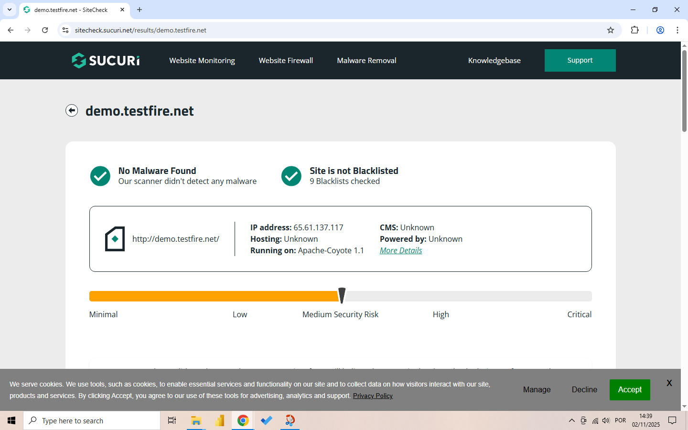
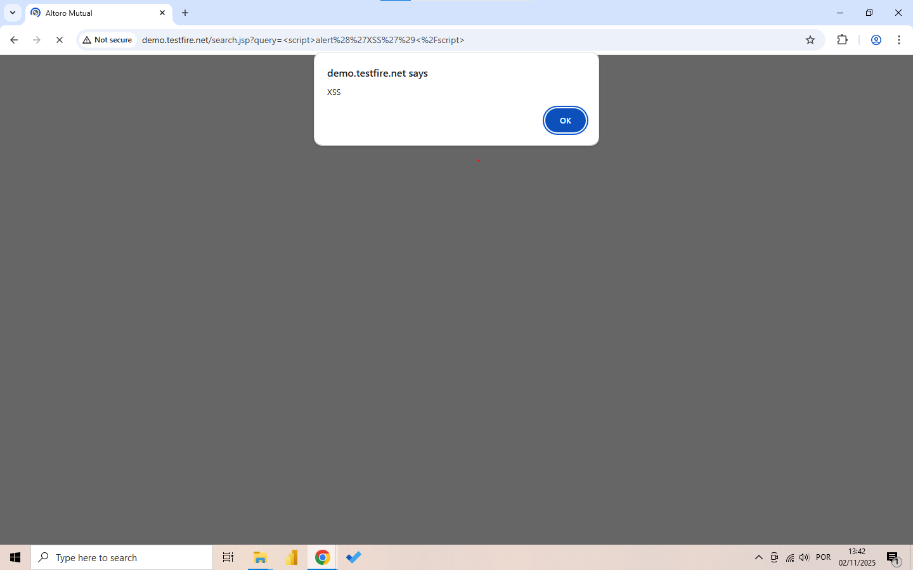
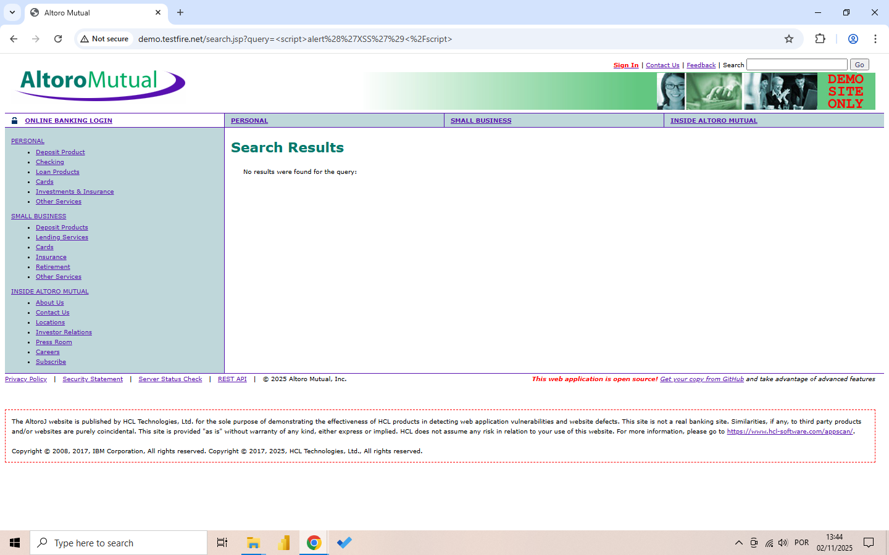
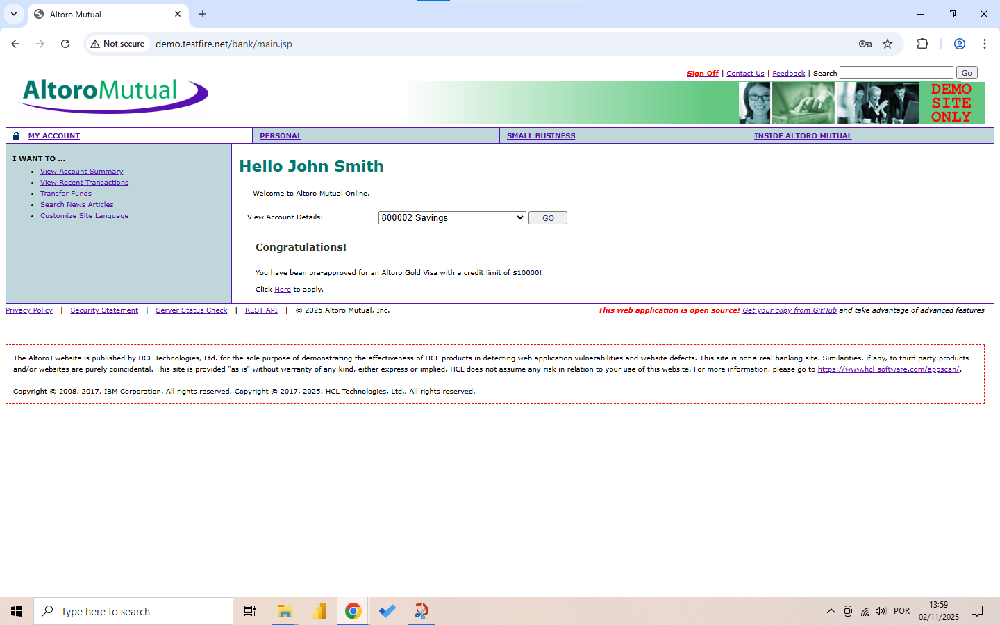
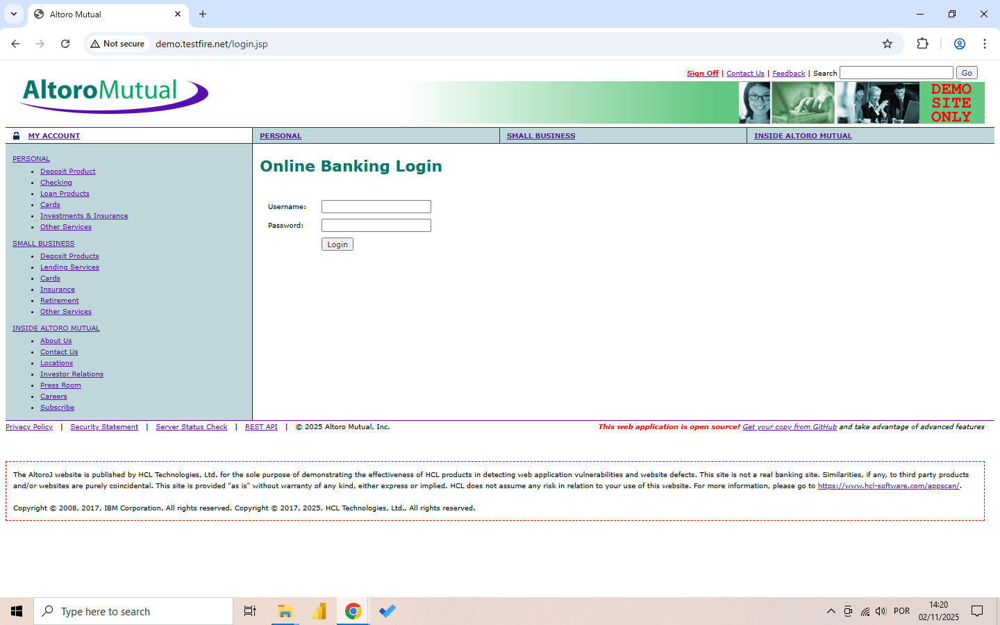
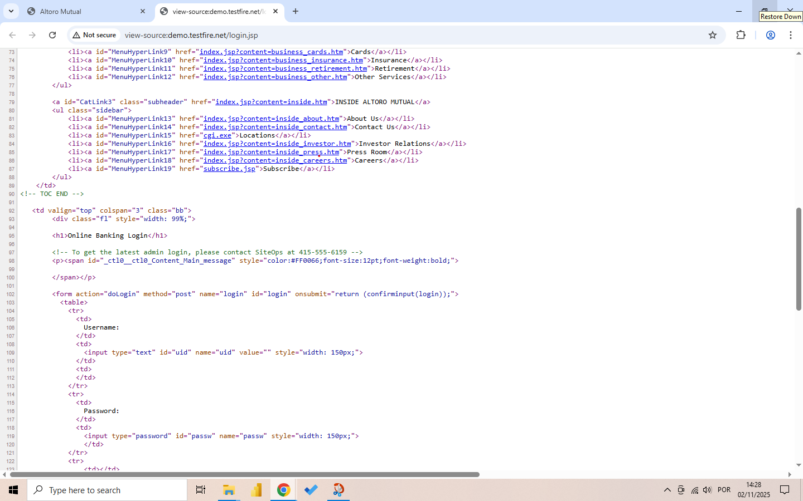

🔒 Security Report - Web Application Testing

📋 About the Project

Security testing performed on the Altoro Mutual web application (demo.testfire.net) as part of the Future Interns program. The objective was to identify vulnerabilities following OWASP standards.

🎯 Methodology
🛠️ Tools: Web browser, manual testing, Sucuri SiteCheck

🎯 Target Application: http://demo.testfire.net

🔍 Approach: Manual testing and online scanning

🔧 Scanning Tools Used
🛡️ Sucuri SiteCheck Scanner
🌐 URL: https://sitecheck.sucuri.net/

✅ Result: No malware detected

📊 Status: Site is not blacklisted

⚙️ Technology: Apache-Coyote/1.1

Evidence:

🔓 Vulnerabilities Identified

🔓 VULNERABILITY 1: Reflected Cross-Site Scripting (XSS)
⚠️ Severity: High
📍 Location: Search field
📝 Description: Malicious script executed in search field

🔧 Reproduction:

bash
1. Access http://demo.testfire.net
2. In Search field, type: 
3. Observe script execution

Evidence:

   
🔓 VULNERABILITY 2: Default/Weak Credentials
⚠️ Severity: High
📍 Location: Login page
📝 Description: Default credentials allow unauthorized access

🔓 Credentials Found:

👤 Username: jsmith

🔒 Password: demo1234

Evidence: 

🔓 VULNERABILITY 3: Information Disclosure
🚨 Severity: Critical
📍 Location: Login page source code
📝 Description: Comment in source code reveals internal administration procedure

💻 Code Excerpt:

html
<!-- To get the latest admin login, please contact SiteOps at 415-555-6159 -->
🛡️ Recommendations
🚨 For VULNERABILITY 1 (XSS):
🔒 Implement input sanitization

🛡️ Use Content Security Policy (CSP)

✅ Validate and encode output data

🔑 For VULNERABILITY 2 (Default Credentials):
🗑️ Remove default credentials

💪 Implement strong password policy

🔐 Add multi-factor authentication

📢 For VULNERABILITY 3 (Information Disclosure):
🧹 Remove sensitive comments from source code

🔍 Review all code for exposed information

🚪 Implement proper access controls

📊 OWASP Top 10 Compliance Checklist
🔓 A01: Broken Access Control

Status: ⚠️ Partial

Evidence: Admin test blocked

🔐 A02: Cryptographic Failures

Status: ✅ Found

Evidence: 

💉 A03: Injection

Status: ✅ Found

Evidence: Reflected XSS

👤 A07: Identification & Authentication Failures

Status: ✅ Found

Evidence:

⚙️ A05: Security Misconfiguration

Status: ✅ Found

Evidence: Information disclosure

🚀 How to Reproduce
📥 Clone this repository

🌐 Access http://demo.testfire.net

📋 Follow steps described in each vulnerability section

📸 Check evidence in the image files

✅ Verify findings using the same methodology

*📄 Report developed for Future Interns program - Cybersecurity Task 1*
🔒 Web Application Security Testing Project

